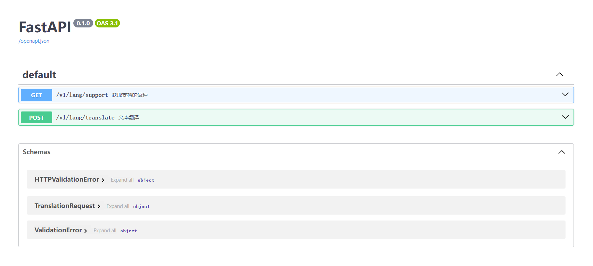

# mbart-api
This model is a fine-tuned checkpoint of mBART-large-50. mbart-large-50-many-to-many-mmt is fine-tuned for multilingual machine translation. It was introduced in Multilingual Translation with Extensible Multilingual Pretraining and Finetuning paper.

The model can translate directly between any pair of 50 languages. To translate into a target language, the target language id is forced as the first generated token. To force the target language id as the first generated token, pass the forced_bos_token_id parameter to the generate method.

[Huggingface Model files](https://huggingface.co/facebook/mbart-large-50-many-to-many-mmt)

- config.json
- pytorch_model.bin
- sentencepiece.bpe.model
- special_tokens_map.json
- tokenizer_config.json

# Languages covered

```Plain Text
Arabic (ar_AR), Czech (cs_CZ), German (de_DE), English (en_XX), Spanish (es_XX), Estonian (et_EE), Finnish (fi_FI), French (fr_XX), Gujarati (gu_IN), Hindi (hi_IN), Italian (it_IT), Japanese (ja_XX), Kazakh (kk_KZ), Korean (ko_KR), Lithuanian (lt_LT), Latvian (lv_LV), Burmese (my_MM), Nepali (ne_NP), Dutch (nl_XX), Romanian (ro_RO), Russian (ru_RU), Sinhala (si_LK), Turkish (tr_TR), Vietnamese (vi_VN), Chinese (zh_CN), Afrikaans (af_ZA), Azerbaijani (az_AZ), Bengali (bn_IN), Persian (fa_IR), Hebrew (he_IL), Croatian (hr_HR), Indonesian (id_ID), Georgian (ka_GE), Khmer (km_KH), Macedonian (mk_MK), Malayalam (ml_IN), Mongolian (mn_MN), Marathi (mr_IN), Polish (pl_PL), Pashto (ps_AF), Portuguese (pt_XX), Swedish (sv_SE), Swahili (sw_KE), Tamil (ta_IN), Telugu (te_IN), Thai (th_TH), Tagalog (tl_XX), Ukrainian (uk_UA), Urdu (ur_PK), Xhosa (xh_ZA), Galician (gl_ES), Slovene (sl_SI)
```

# install
```
git clone https://github.com/leoterry-ulrica/mbart-api
cd mbart-api
pip install -r requirements.txt
# 下载模型文件：facebook/mbart-large-50-many-to-many-mmt，放在指定目录，设置环境变量：MODEL_PATH
uvicorn main:app
```

# docker-compose
```
# 根据实际情况，设置volume，用于读取模型文件。
# 如果需要重新构建镜像，则在后面加上：--build
docker-compose up -d
# 如果需要GPU运行，指定-f配置文件
docker-compose -f docker-compose.gpu.yml up -d
```

# FastAPI
